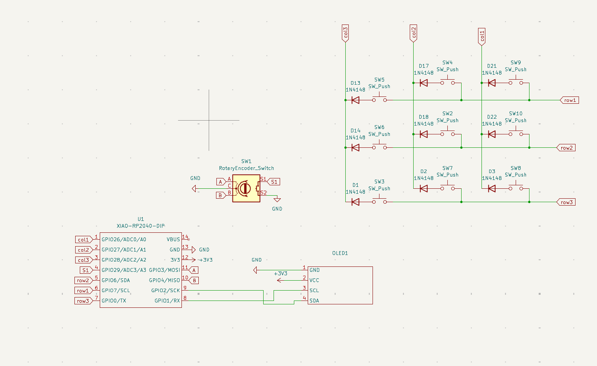
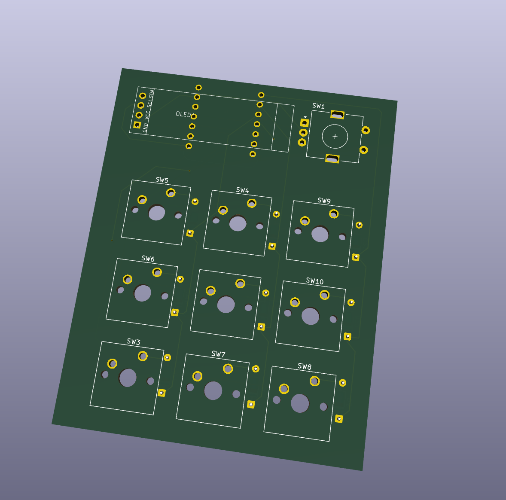
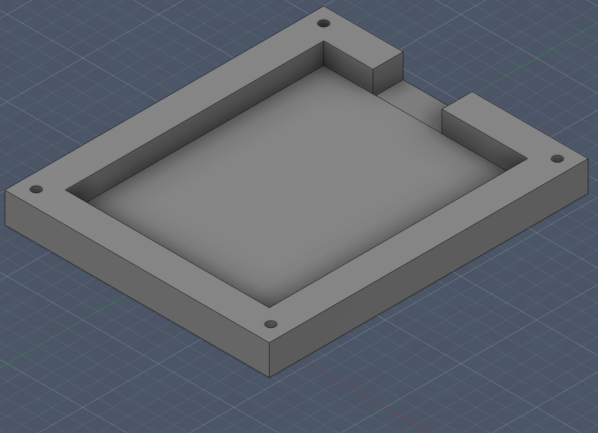
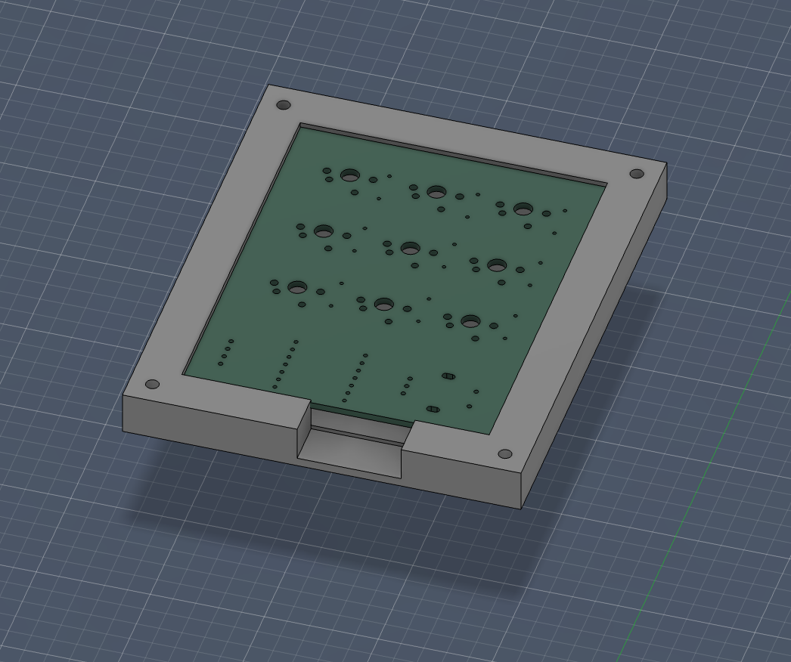
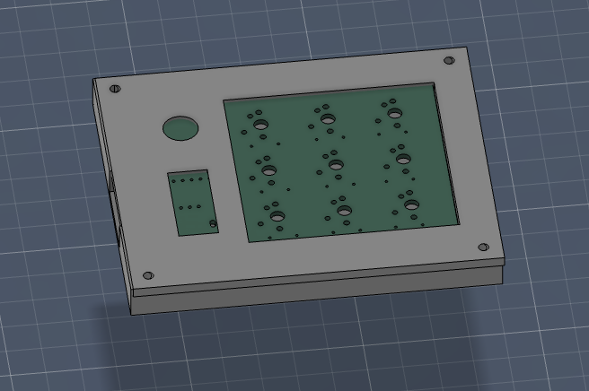

# CadPad (Hack Club Hackpad)

This was my first hardware project and also the first time for me to use a CAD software (it ragebaited me so hard, so I named my project CadPad :D). It has 9 keys, 1 rotary encoder and 1 OLED screen and a very simple case. I mostly followed the guide for the beginning part but then had to read up on a lot of stuff to complete this project.

## BOM

| Item | Quantity |
| --- | --- |
| pcb | 1x |
| Seeed XIAO RP2040 | 1x |
| OLED Display 0.91 inch | 1x |
| EC11 rotary encoder | 1x |
| Cherry MX Switches | 9x |
| Blank DSA keycaps | 9x |
| Through-hole 1N4148 Diodes | 9x |
| M3×16 mm Screws | 4x |

All of the parts are already present in the kit mentioned at Hackpad page, so no extra costs i think?
